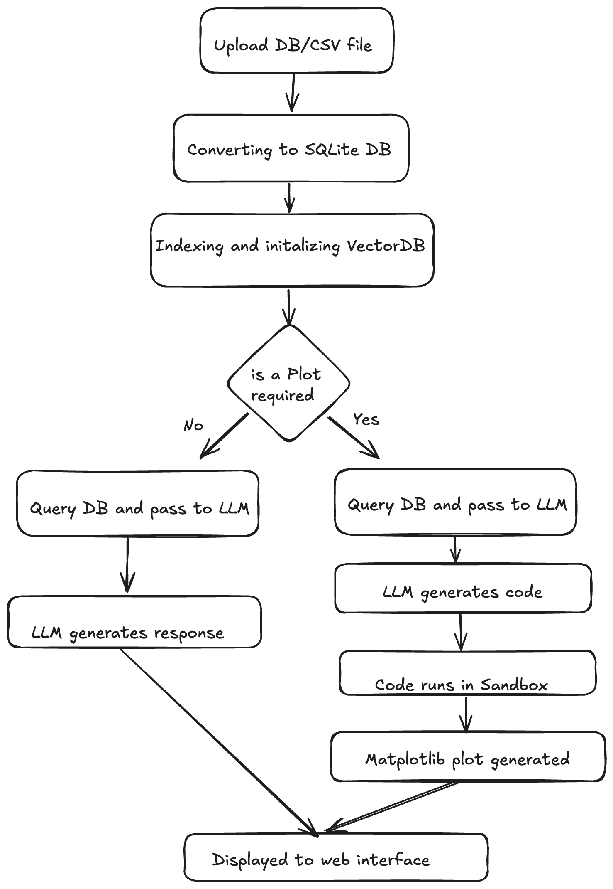

# AskDB

AskDB is a Streamlit-powered application that lets you interact with your SQLite databases or CSV files using natural language queries. It leverages AI Agents to generate SQL, run queries, and visualize results as interactive charts—all from a simple web interface.

---

## Features

- **Proper noun search:** Creates accurate queries using semantic searching.
- **Secure Python code execution:** Uses a sandboxed environment for running generated code.
- **Automatic SQL generation** and execution using LLMs.
- **Smart charting:** The agent decides the best matplotlib chart for your query and generates it.
- **Upload any SQLite `.db` or CSV file `.csv`** and query it using plain English.


---

## System Architecture



---

## Quickstart

### 1. Clone the repository

```bash
git clone https://github.com/kkchemboli/querytovis.git
cd querytovis
```

### 2. Install dependencies

This project uses [uv](https://github.com/astral-sh/uv) as the package manager (a fast Python package installer and resolver).

```bash
uv sync
```

### 3. Start the Streamlit app

```bash
streamlit run frontend.py --server.maxUploadSize 100
```

### 4. Usage

1. **Upload your SQLite database or CSV file** (`.db` file or `.csv`) via the web interface.
2. **Enter a natural language query** (e.g., "Show a bar chart of the top 5 artists by album count").
3. **View the results:**  
   - Plot is generated if your query requires it , if not generates response.

---

## Project Structure

```
AskDB/
├── frontend.py           # Streamlit web app
├── main.py               # Core agent logic (async) using Langgraph for orchestration.
├── helper_functions.py   # Utility functions for proper noun search etc.
├── tools.py              # Custom LangChain tools (retriever)
├── README.md             # This file
├── pyproject.toml        # Project metadata and dependencies
├── uv.lock               # Locked dependency versions
├── sys_prompt.py         # Prompts for agents     
├── assets/
   ├── AskDB.png          # System Architecture     
```

---

## Notes

- **Security:** All Python code generated by the LLM is executed in a sandboxed environment for safety.

---

## License

MIT License

---
